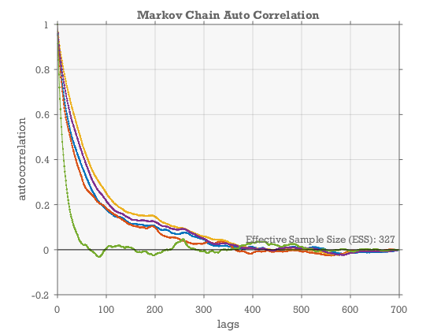
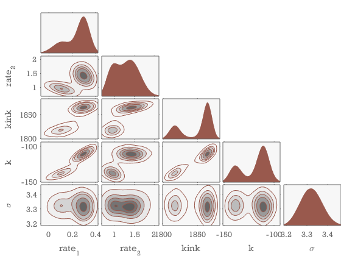
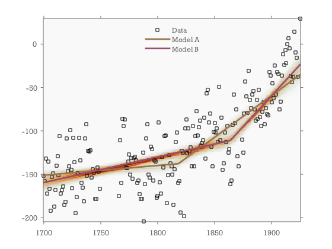

Fitting a discontinous line
=======================================

This code fits a trend-change model to a historical time series of sea level in Amsterdam with gaps.


Input data
----------------------------------------------------------

Amsterdam sea level from this source: http://www.psmsl.org/data/longrecords/

```matlab
Y=[1700 -152;1701 -158;1702 -132;1703 -172;1704 -135;1705 -167;1706 -192;1707 -153;1708 -149;1709 -187;1710 -168;1711 -140;1712 -129;1713 -151;
   1714 -106;1715 -172;1716 -168;1717 -164;1718 -185;1719 -182;1720 -109;1721 -146;1722 -141;1723 -99;1724 -145;1725 -166;1726 -108;1727 -136;
   1728 -195;1729 -176;1730 -148;1731 -108;1732 -134;1733 -160;1734 -165;1735 -181;1736 -109;1737 -92;1738 -152;1739 -123;1740 -124;1741 -122;
   1742 -154;1743 -144;1744 -148;1745 -178;1746 -178;1747 -142;1748 -147;1749 -167;1766 -175;1767 -111;1768 -160;1769 -86;1770 -94;1771 -87;
   1772 -142;1773 -143;1774 -135;1775 -127;1776 -150;1777 -131;1778 -155;1779 -131;1780 -130;1781 -134;1782 -160;1783 -157;1784 -173;1785 -178;
   1786 -178;1787 -125;1788 -204;1789 -161;1790 -109;1791 -92;1792 -150;1793 -154;1794 -118;1795 -121;1796 -157;1797 -134;1798 -135;1799 -177;
   1800 -175;1801 -90;1802 -159;1803 -172;1804 -130;1805 -142;1806 -106;1807 -105;1808 -183;1809 -151;1810 -128;1811 -137;1812 -141;1813 -150;
   1814 -185;1815 -144;1816 -113;1817 -102;1818 -160;1819 -158;1820 -194;1821 -123;1822 -125;1823 -198;1824 -97;1825 -87;1826 -126;1827 -97;
   1828 -124;1829 -119;1830 -141;1831 -94;1832 -141;1833 -106;1834 -77;1835 -105;1836 -96;1837 -88;1838 -117;1839 -114;1840 -111;1841 -85;
   1842 -132;1843 -57;1844 -53;1845 -90;1846 -80;1847 -118;1848 -141;1849 -101;1850 -91;1851 -102;1852 -97;1853 -113;1854 -49;1855 -111;
   1856 -85;1857 -145;1858 -137;1859 -102;1860 -113;1861 -94;1862 -125;1863 -121;1864 -161;1865 -157;1866 -93;1867 -58;1868 -91;1869 -75;1870 -129;
   1871 -141;1874 -110;1875 -125;1876 -80;1877 -43;1878 -60;1879 -79;1880 -31;1881 -64;1882 -74;1883 -58;1884 -54;1885 -75;1886 -88;1887 -64;1888 -86;
   1889 -53;1890 -84;1891 -94;1892 -78;1893 -67;1894 -92;1895 -74;1896 -81;1897 -82;1898 -32;1899 -36;1900 -67;1901 -45;1902 -62;1903 -25;1904 -58;1905 -32;
   1906 -34;1907 -75;1908 -66;1909 -36;1910 -12;1911 -24;1912 -7;1913 -22;1914 0;1915 7;1916 -5;1917 -37;1918 -44;1919 -38;1920 14;1921 -10;1922 -16;1923 -38;1925 29];
t=Y(:,1);
Y=Y(:,2);
```


Define trend change model:
----------------------------------------------------------

```matlab
forwardmodel=@(m)(m(1)*(t<m(3))+m(2)*(t>m(3))).*(t-m(3))+m(4);
```


Make an initial guess for the model parameters.
----------------------------------------------------------

```matlab
p=polyfit(t-mean(t),Y,1);
m0=[p(1) p(1) mean(t) p(2)]';
sigma=std(Y-forwardmodel(m0));
m0=[m0 ; log(sigma)];
```


Likelihood
----------------------------------------------------------

We assume the data are normally distributed around the forward model.

```matlab
% First we define a helper function equivalent to calling log(normpdf(x,mu,sigma))
% but has higher precision because it avoids truncation errors associated with calling
% log(exp(xxx)).
lognormpdf=@(x,mu,sigma)-0.5*((x-mu)./sigma).^2  -log(sqrt(2*pi).*sigma);


logLike=@(m)sum(lognormpdf(y,forwardmodel(m),m(5)));
```


Prior information
----------------------------------------------------------

We want to restrict the model to place the kink-point within the observed time interval. All other parameters have a uniform prior.

```matlab
logprior = @(m)(m(3)>min(t))&(m(3)<max(t));
```


Find the posterior distribution using GWMCMC
----------------------------------------------------------

Now we apply the MCMC hammer to draw samples from the posterior.

```matlab
% first we initialize the ensemble of walkers in a small gaussian ball
% around the m0 estimate.

ball=randn(length(m0),30)*0.1;
ball(:,3)=ball(:,3)*200;
mball=bsxfun(@plus,m0,ball);
```


Apply the hammer:
----------------------------------------------------------

Draw samples from the posterior

```matlab
tic
m=gwmcmc(mball,{logprior logL},300000,'burnin',.3,'stepsize',2);
toc
```

```
Elapsed time is 24.627998 seconds.

```
    

Plot the auto-correlation function
----------------------------------------------------------

And determine the effective sample size.

```matlab
figure
[C,lags,ESS]=eacorr(m);
plot(lags,C,'.-',lags([1 end]),[0 0],'k');
grid on
xlabel('lags')
ylabel('autocorrelation');
text(lags(end),0,sprintf('Effective Sample Size (ESS): %.0f_ ',ceil(mean(ESS))),'verticalalignment','bottom','horizontalalignment','right')
title('Markov Chain Auto Correlation')
```




Corner plot of parameters
----------------------------------------------------------

The corner plot shows a bi-modal distribution with two different places you might place the kink in the trend-change model.

```matlab
figure
ecornerplot(m,'ks',true,'color',[.6 .35 .3],'names',{'rate_1' 'rate_2' 'kink' 'intercept' '\sigma'})
```




Plot of posterior fit
----------------------------------------------------------

```matlab
figure
m=m(:,:)'; %flatten the chain

%plot 100 samples...
for kk=1:100
    r=ceil(rand*size(m,1));
    h=plot(t,forwardmodel(m(r,:)),'color',[.6 .35 .3].^.3);
    hold on
end
h(2)=plot(t,Y);

h(3)=plot(t,forwardmodel(median(m)),'color',[.6 .35 .3],'linewidth',3);


axis tight
legend(h,'Samples from posterior','Data','GWMCMC median')
```


