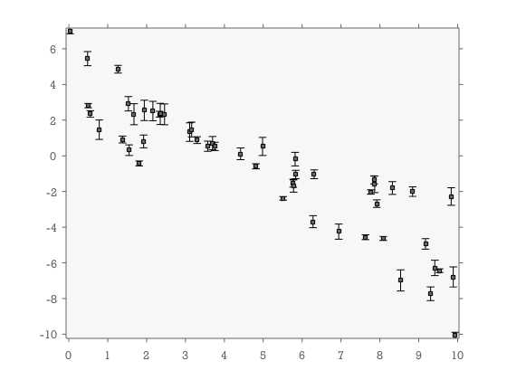
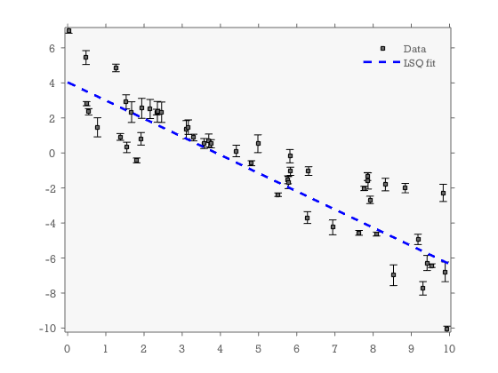
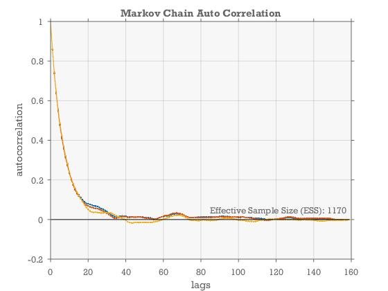
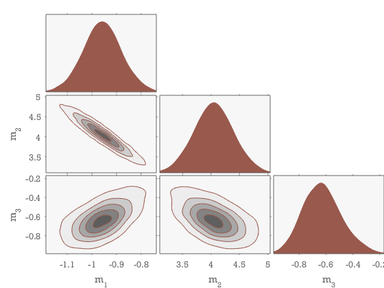

Fitting a line
=======================================

This demo follows the linefit example of EMCEE for python. See full description here: http://dan.iel.fm/emcee/current/user/line/


Generate synthetic data
----------------------------------------------------------

First we generate some noisy data which falls on a line. We know the true parameters of the line and the parameters of the noise added to the observations.

In this surrogate data there are two sources of uncertainty. One source with known variance (yerr), and another multiplicative uncertainty with unknown variance.

```matlab
% This is the true model parameters used to generate the noise
m_true = [-0.9594;4.294;log(0.534)]

N = 50;
x = sort(10*rand(1,N));
yerr = 0.1+0.5*rand(1,N);
y = m_true(1)*x+m_true(2);
y = y + abs(exp(m_true(3))*y) .* randn(1,N);
y = y + yerr .* randn(1,N);


close all %close all figures
errorbar(x,y,yerr,'ks','markerfacecolor',[1 1 1]*.4,'markersize',4);
axis tight
```

```
m_true =
      -0.9594
        4.294
     -0.62736

```
    



Least squares fit
----------------------------------------------------------

lscov can be used to fit a straight line to the data assuming that the errors in yerr are correct. Notice how this results in very optimistic uncertainties on the slope and intercept. This is because this method only accounts for the known source of error.

```matlab
[m_lsq,sigma_mlsq,MSE]=lscov([x;ones(size(x))]',y',diag(yerr.^2));
sigma_m_lsq=sigma_mlsq/sqrt(MSE); %see help on lscov
m_lsq
sigma_m_lsq

hold on
plot(x,polyval(m_lsq,x),'b--','linewidth',2)
legend('Data','LSQ fit')
```

```
m_lsq =
     -0.85054
       4.0052
sigma_m_lsq =
     0.014015
     0.079295

```
    



Likelihood
----------------------------------------------------------

We define a likelihood function consistent with how the data was generated, and then we use fminsearch to find the max-likelihood fit of the model to the data.

```matlab
% First we define a helper function equivalent to calling log(normpdf(x,mu,sigma))
% but has higher precision because it avoids truncation errors associated with calling
% log(exp(xxx)).
lognormpdf=@(x,mu,sigma)-0.5*((x-mu)./sigma).^2  -log(sqrt(2*pi).*sigma);

forwardmodel=@(m)m(1)*x + m(2);
variancemodel=@(m) yerr.^2 + (forwardmodel(m)*exp(m(3))).^2;

logLike=@(m)sum(lognormpdf(y,forwardmodel(m),sqrt(variancemodel(m))));

m_maxlike=fminsearch(@(m)-logLike(m),[polyfit(x,y,1) 0]');
```


Prior information
----------------------------------------------------------

Here we formulate our prior knowledge about the model parameters. Here we use flat priors within a hard limits for each of the 3 model parameters.

```matlab
logprior =@(m) log( double((m(1)>-5)&&(m(1)<0.5) && (m(2)>0)&&(m(2)<10) && (m(3)>-10)&&(m(3)<1)) );
```


Find the posterior distribution using GWMCMC
----------------------------------------------------------

Now we apply the MCMC hammer to draw samples from the posterior.

```matlab
% first we initialize the ensemble of walkers in a small gaussian ball
% around the max-likelihood estimate.
minit=bsxfun(@plus,m_maxlike,randn(3,100)*0.01);
```


Apply the hammer:
----------------------------------------------------------

Draw samples from the posterior

```matlab
tic
m=gwmcmc(minit,{logprior logLike},100000,'ThinChain',5);
toc
```

```
Elapsed time is 4.864187 seconds.

```
    

Remove burn-in
----------------------------------------------------------

```matlab
m(:,:,1:end*.2)=[]; %crop 20% to get rid of burn-in.
```


Auto-correlation function
----------------------------------------------------------

```matlab
figure
[C,lags,ESS]=eacorr(m);
plot(lags,C,'.-',lags([1 end]),[0 0],'k');
grid on
xlabel('lags')
ylabel('autocorrelation');
text(lags(end),0,sprintf('Effective Sample Size (ESS): %.0f_ ',ceil(mean(ESS))),'verticalalignment','bottom','horizontalalignment','right')
title('Markov Chain Auto Correlation')
```




Corner plot of parameters
----------------------------------------------------------

```matlab
figure
ecornerplot(m,'ks',true,'color',[.6 .35 .3])
```




Plot of posterior fit
----------------------------------------------------------

```matlab
figure
m=m(:,:)'; %flatten the chain

%plot 100 samples...
for kk=1:100
    r=ceil(rand*size(m,1));
    h=plot(x,forwardmodel(m(r,:)),'color',[.6 .35 .3].^.3);
    hold on
end
h(2)=errorbar(x,y,yerr,'ks','markerfacecolor',[1 1 1]*.4,'markersize',4);

h(4)=plot(x,forwardmodel(m_lsq),'b--','linewidth',2);
h(3)=plot(x,forwardmodel(median(m)),'color',[.6 .35 .3],'linewidth',3);
h(5)=plot(x,forwardmodel(m_true),'r','linewidth',2);

axis tight
legend(h,'Samples from posterior','Data','GWMCMC median','LSQ fit','Truth')
```


